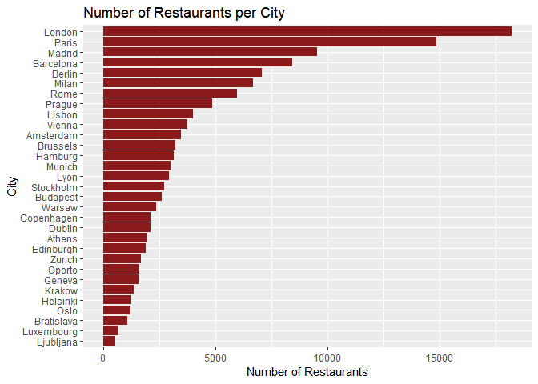
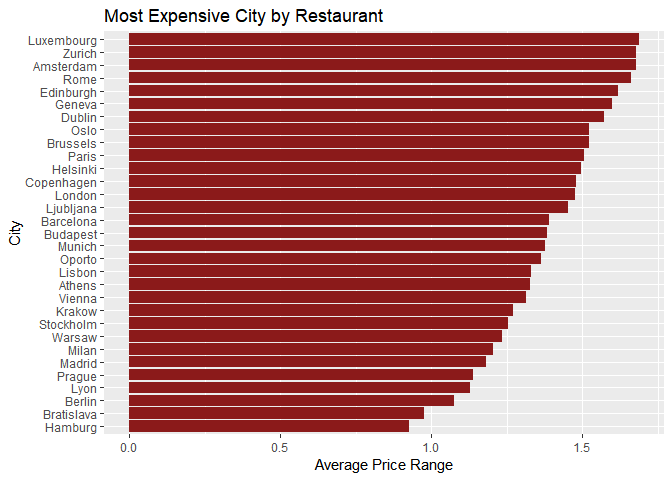
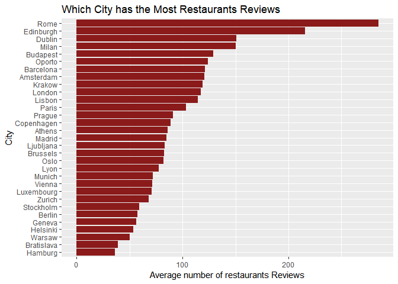
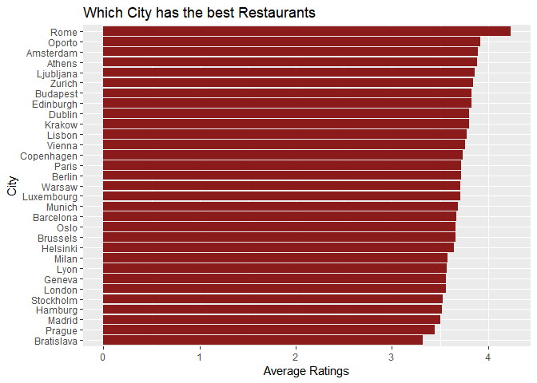

Frameworks Final Project: Data Exloration
================

``` r
library(knitr); library(Hmisc); library(DT); library(ggplot2); library(dplyr); 
library(reshape2); library(ggthemes); library(stringr); library(data.table); library(tidytext); library(recommenderlab); library(qdapTools); library(purrr); library(devtools)
```

``` r
name = "Name"
city.name = "City"
cuisine.name = "Cuisine Style"
ranking.name = "Ranking"
rating.name = "Rating"
price.name = "Price Range"
number.reviews.name = "Number of Reviews"
review.name = "Reviews"
```

``` r
dat <- fread(input ='Data/TA_restaurants_curated_clean.csv', verbose = FALSE)
```

    ##           City count Average Price Range Average Rating
    ##  1:     London 18212            1.477076       3.558396
    ##  2:      Paris 14874            1.504605       3.717023
    ##  3:     Madrid  9543            1.182280       3.506183
    ##  4:  Barcelona  8425            1.390623       3.669614
    ##  5:     Berlin  7078            1.074315       3.716233
    ##  6:      Milan  6687            1.205025       3.575146
    ##  7:       Rome  5949            1.661120       4.232140
    ##  8:     Prague  4859            1.138094       3.446182
    ##  9:     Lisbon  3986            1.328901       3.773583
    ## 10:     Vienna  3724            1.313507       3.760204
    ## 11:  Amsterdam  3434            1.676616       3.896768
    ## 12:   Brussels  3204            1.522628       3.657615
    ## 13:    Hamburg  3131            0.926062       3.523315
    ## 14:     Munich  2995            1.375459       3.688982
    ## 15:       Lyon  2930            1.129693       3.571843
    ## 16:  Stockholm  2705            1.255083       3.526987
    ## 17:   Budapest  2606            1.382003       3.828665
    ## 18:     Warsaw  2352            1.234269       3.710884
    ## 19: Copenhagen  2109            1.479137       3.732812
    ## 20:     Dublin  2082            1.573487       3.804035
    ## 21:     Athens  1938            1.325335       3.882611
    ## 22:  Edinburgh  1865            1.618767       3.828418
    ## 23:     Zurich  1667            1.678464       3.844931
    ## 24:     Oporto  1580            1.363291       3.920886
    ## 25:     Geneva  1572            1.598282       3.558524
    ## 26:     Krakow  1354            1.269202       3.801699
    ## 27:   Helsinki  1228            1.495114       3.647801
    ## 28:       Oslo  1213            1.523908       3.659110
    ## 29: Bratislava  1067            0.975164       3.323805
    ## 30: Luxembourg   657            1.687215       3.708524
    ## 31:  Ljubljana   501            1.453094       3.856287
    ##           City count Average Price Range Average Rating
    ##     Average number of reviews
    ##  1:                 117.31117
    ##  2:                 103.36513
    ##  3:                  84.90695
    ##  4:                 121.13329
    ##  5:                  57.49322
    ##  6:                 150.03051
    ##  7:                 284.85493
    ##  8:                  91.06298
    ##  9:                 114.21977
    ## 10:                  71.44952
    ## 11:                 120.68841
    ## 12:                  82.64170
    ## 13:                  35.89077
    ## 14:                  72.12788
    ## 15:                  77.22799
    ## 16:                  59.12089
    ## 17:                 128.76401
    ## 18:                  49.89626
    ## 19:                  88.85111
    ## 20:                 150.57253
    ## 21:                  86.13777
    ## 22:                 215.57373
    ## 23:                  68.04079
    ## 24:                 123.86899
    ## 25:                  56.46947
    ## 26:                 118.62408
    ## 27:                  53.25489
    ## 28:                  81.82688
    ## 29:                  38.83224
    ## 30:                  70.93760
    ## 31:                  83.24551
    ##     Average number of reviews

``` r
ggplot(data = city.dat) + geom_bar(stat = 'identity', fill = 'firebrick4', 
                                     aes(x = reorder(City,count), y = count)) + 
 xlab('City') + ylab('Number of Restaurants')+coord_flip() + theme_get()  + 
 ggtitle('Number of Restaurants per City')
```

<!-- -->

``` r
ggplot(data = city.dat) + geom_bar(stat = 'identity', fill = 'firebrick4', 
                                     aes(x = reorder(City,`Average Price Range`), y = `Average Price Range`)) + 
 xlab('City') + ylab('Average Price Range')+coord_flip() + theme_get()  + 
 ggtitle('Most Expensive City by Restaurant')
```

<!-- -->

``` r
ggplot(data = city.dat) + geom_bar(stat = 'identity', fill = 'firebrick4', 
                                     aes(x = reorder(City,`Average number of reviews`), y = `Average number of reviews`)) + 
 xlab('City') + ylab('Average number of restaurants Reviews')+coord_flip() + theme_get()  + 
 ggtitle('Which City has the Most Restaurants Reviews')
```

<!-- -->

``` r
ggplot(data = city.dat) + geom_bar(stat = 'identity', fill = 'firebrick4', 
                                     aes(x = reorder(City,`Average Rating`), y = `Average Rating`)) + 
 xlab('City') + ylab('Average Ratings')+coord_flip() + theme_get() + 
 ggtitle('Which City has the best Restaurants') 
```

<!-- -->

``` r
#Correlation between review rating and longer reviews
cor_char <- cor(nchar(dat$Reviews),dat$Rating,use="complete.obs")
cor_char
```

    ## [1] 0.4377277

``` r
cor.test(nchar(dat$Reviews),dat$Rating)
```

    ## 
    ##  Pearson's product-moment correlation
    ## 
    ## data:  nchar(dat$Reviews) and dat$Rating
    ## t = 172.49, df = 125520, p-value < 2.2e-16
    ## alternative hypothesis: true correlation is not equal to 0
    ## 95 percent confidence interval:
    ##  0.4332448 0.4421889
    ## sample estimates:
    ##       cor 
    ## 0.4377277

``` r
#Correlation with review length in words
cor_words= cor(str_count(string = dat$Reviews,pattern = '\\S+'),dat$Rating,use="complete.obs")
cor_words
```

    ## [1] 0.4200774

``` r
cor.test(str_count(string = dat$Reviews,pattern = '\\S+'),dat$Rating)
```

    ## 
    ##  Pearson's product-moment correlation
    ## 
    ## data:  str_count(string = dat$Reviews, pattern = "\\S+") and dat$Rating
    ## t = 164, df = 125520, p-value < 2.2e-16
    ## alternative hypothesis: true correlation is not equal to 0
    ## 95 percent confidence interval:
    ##  0.4155110 0.4246226
    ## sample estimates:
    ##       cor 
    ## 0.4200774

``` r
#Correlation with review sentence
cor_sentence= cor(str_count(string = dat$Reviews,pattern = "[A-Za-z,;'\"\\s]+[^.!?]*[.?!]"),dat$Rating,use="complete.obs")
cor_sentence
```

    ## [1] 0.179211

``` r
cor.test(str_count(string = dat$Reviews,pattern = "[A-Za-z,;'\"\\s]+[^.!?]*[.?!]"),dat$Rating,use="complete.obs")
```

    ## 
    ##  Pearson's product-moment correlation
    ## 
    ## data:  str_count(string = dat$Reviews, pattern = "[A-Za-z,;'\"\\s]+[^.!?]*[.?!]") and dat$Rating
    ## t = 64.538, df = 125520, p-value < 2.2e-16
    ## alternative hypothesis: true correlation is not equal to 0
    ## 95 percent confidence interval:
    ##  0.1738514 0.1845600
    ## sample estimates:
    ##      cor 
    ## 0.179211

``` r
#Using lexicon bing
subdat= dat[,c("V1", "Rating", "Reviews")]
subdat%>%
  group_by(V1)%>%
  unnest_tokens(output = word, input = Reviews)%>%
  inner_join(get_sentiments('bing'))%>%
  group_by(sentiment)
```

    ## # A tibble: 174,324 x 4
    ## # Groups:   sentiment [2]
    ##       V1 Rating word      sentiment
    ##    <int>  <dbl> <chr>     <chr>    
    ##  1     1    5   like      positive 
    ##  2     1    5   warm      positive 
    ##  3     1    5   welcome   positive 
    ##  4     2    4.5 great     positive 
    ##  5     2    4.5 perfect   positive 
    ##  6     3    4.5 delicious positive 
    ##  7     4    5   superb    positive 
    ##  8     4    5   fine      positive 
    ##  9     5    4.5 best      positive 
    ## 10     5    4.5 super     positive 
    ## # ... with 174,314 more rows

``` r
#Positive and Negative Words in Reviews
subdat%>%
  group_by(V1)%>%
  unnest_tokens(output = word, input = Reviews)%>%
  inner_join(get_sentiments('bing'))%>%
  group_by(sentiment)%>%
  count()%>%
  ggplot(aes(x=sentiment,y=n,fill=sentiment))+geom_col()+theme_economist()+guides(fill=F)
```

<!-- -->

``` r
#Proportion of Positive words in Reviews
subdat %>%
  select(V1,Reviews)%>%
  group_by(V1)%>%
  unnest_tokens(output=word,input=Reviews)%>%
  ungroup()%>%
  inner_join(get_sentiments('bing'))%>%
  group_by(sentiment)%>%
  summarize(n = n())%>%
  mutate(proportion = n/sum(n))
```

    ## # A tibble: 2 x 3
    ##   sentiment      n proportion
    ##   <chr>      <int>      <dbl>
    ## 1 negative   21093      0.121
    ## 2 positive  153231      0.879

``` r
#Are positive reviews helpful?
subdat %>%
  select(V1,Reviews,Rating)%>%
  group_by(V1)%>%
  unnest_tokens(output=word,input=Reviews)%>%
  ungroup()%>%
  inner_join(get_sentiments('bing'))%>%
  group_by(Rating,sentiment)%>%
  summarize(n = n())%>%
  mutate(proportion = n/sum(n))%>%
  ggplot(aes(x=Rating,y=proportion,fill=sentiment))+geom_col()+theme_economist()
```

<!-- -->

``` r
#Emotions in ratings
subdat%>%
  group_by(V1)%>%
  unnest_tokens(output = word, input = Reviews)%>%
  inner_join(get_sentiments('nrc'))%>%
  group_by(sentiment)%>%
  count()%>%
  ggplot(aes(x=reorder(sentiment,X = n),y=n,fill=sentiment))+geom_col()+guides(fill=F)+coord_flip()+theme_get()
```

<!-- -->

``` r
#Rating and emotions
subdat%>%
  group_by(V1)%>%
  unnest_tokens(output = word, input = Reviews)%>%
  inner_join(get_sentiments('nrc'))%>%
  group_by(V1,sentiment,Rating)%>%
  count()
```

    ## # A tibble: 324,494 x 4
    ## # Groups:   V1, sentiment, Rating [324,494]
    ##       V1 sentiment    Rating     n
    ##    <int> <chr>         <dbl> <int>
    ##  1     2 anticipation    4.5     1
    ##  2     2 joy             4.5     2
    ##  3     2 positive        4.5     2
    ##  4     2 trust           4.5     2
    ##  5     3 joy             4.5     1
    ##  6     3 positive        4.5     1
    ##  7     3 trust           4.5     1
    ##  8     4 anticipation    5       1
    ##  9     4 joy             5       2
    ## 10     4 positive        5       4
    ## # ... with 324,484 more rows

``` r
#Correlation between emotion and rating
subdat%>%
  group_by(V1)%>%
  unnest_tokens(output = word, input = Reviews)%>%
  inner_join(get_sentiments('nrc'))%>%
  group_by(V1,sentiment,Rating)%>%
  count()%>%
  ungroup()%>%
  group_by(sentiment)%>%
  summarize(correlation = cor(n,Rating))
```

    ## # A tibble: 10 x 2
    ##    sentiment    correlation
    ##    <chr>              <dbl>
    ##  1 anger            -0.141 
    ##  2 anticipation     -0.0182
    ##  3 disgust          -0.152 
    ##  4 fear             -0.164 
    ##  5 joy               0.0347
    ##  6 negative         -0.180 
    ##  7 positive          0.0542
    ##  8 sadness          -0.0984
    ##  9 surprise         -0.0137
    ## 10 trust             0.0196

``` r
subdat %>%
  select(V1,Reviews)%>%
  group_by(V1)%>%
  unnest_tokens(output=word,input=Reviews)%>%
  inner_join(get_sentiments('afinn'))%>%
  summarize(reviewSentiment = mean(score))%>%
  ungroup()%>%
  summarize(min=min(reviewSentiment),max=max(reviewSentiment),median=median(reviewSentiment),mean=mean(reviewSentiment))
```

    ## # A tibble: 1 x 4
    ##     min   max median  mean
    ##   <dbl> <dbl>  <dbl> <dbl>
    ## 1    -4     5      3  2.40

``` r
#Distribution of afinn lexicon scores
subdat %>%
  select(V1,Reviews)%>%
  group_by(V1)%>%
  unnest_tokens(output=word,input=Reviews)%>%
  inner_join(get_sentiments('afinn'))%>%
  summarize(reviewSentiment = mean(score))%>%
  ungroup()%>%
  ggplot(aes(x=reviewSentiment,fill=reviewSentiment>0))+
  geom_histogram(binwidth = 0.1)+
  scale_x_continuous(breaks=seq(-5,5,1))+scale_fill_manual(values=c('tomato','seagreen'))+
  guides(fill=F)+
  theme_get()
```

<!-- -->

``` r
subdat= dat[,c("City", "Rating", "Reviews")]

#Positive words and negative words in different cities
subdat%>%
  group_by(City)%>%
  unnest_tokens(output = word, input = Reviews)%>%
  inner_join(get_sentiments('bing'))%>%
  group_by(City, sentiment)%>%
  count()%>%
  ggplot(aes(x=City,y=n,fill=sentiment))+geom_col()+theme_economist()+guides(fill=F)+ coord_flip()
```

<!-- -->

``` r
#Similar distribution of emotions
subdat%>%
  group_by(City)%>%
  unnest_tokens(output = word, input = Reviews)%>%
  inner_join(get_sentiments('nrc'))%>%
  group_by(sentiment, City)%>%
  count()%>%
  ggplot(aes(x=City,y=n,fill=sentiment))+geom_bar(position = "fill", stat='identity')+guides(fill=F)+coord_flip()+theme_get()
```

<!-- -->

``` r
#Sentiment mean, median, max and min 
subdat %>%
  select(City,Reviews)%>%
  group_by(City)%>%
  unnest_tokens(output=word,input=Reviews)%>%
  inner_join(get_sentiments('afinn'))%>%
  summarize(reviewMeanSentiment = mean(score), 
            reviewMedianSentiment = median(score), reviewMaxSentiment = max(score),
            reviewMinSentiment = min(score))
```

    ## # A tibble: 31 x 5
    ##    City  reviewMeanSenti~ reviewMedianSen~ reviewMaxSentim~
    ##    <chr>            <dbl>            <dbl>            <dbl>
    ##  1 Amst~             2.52                3                5
    ##  2 Athe~             2.56                3                5
    ##  3 Barc~             2.39                3                5
    ##  4 Berl~             2.46                3                5
    ##  5 Brat~             2.26                3                5
    ##  6 Brus~             2.27                3                5
    ##  7 Buda~             2.34                3                5
    ##  8 Cope~             2.47                3                5
    ##  9 Dubl~             2.39                3                5
    ## 10 Edin~             2.39                3                5
    ## # ... with 21 more rows, and 1 more variable: reviewMinSentiment <dbl>

``` r
#Look at correlation between rating and ranking
cor_rank=cor(dat$Ranking,dat$Rating,use="complete.obs")
cor_rank
```

    ## [1] -0.7200154

``` r
#Trends- number of vegan options and gluten-free options?
dat[get("Gluten Free Options") == 1, .N, by=city.name]
```

    ##          City N
    ##  1: Barcelona 2
    ##  2:  Budapest 1
    ##  3:    London 2
    ##  4:      Lyon 2
    ##  5:    Madrid 4
    ##  6:     Milan 3
    ##  7:    Oporto 1
    ##  8:     Paris 1
    ##  9:    Prague 1
    ## 10: Stockholm 1

``` r
dat[get("Vegan Options") == 1, .N, by=city.name]
```

    ##           City N
    ##  1:  Amsterdam 1
    ##  2:     Athens 2
    ##  3:  Barcelona 1
    ##  4:     Berlin 6
    ##  5: Copenhagen 2
    ##  6:     Geneva 1
    ##  7:    Hamburg 2
    ##  8:  Ljubljana 2
    ##  9:     London 1
    ## 10:     Madrid 5
    ## 11:      Milan 9
    ## 12:     Munich 2
    ## 13:      Paris 2
    ## 14:     Prague 1
    ## 15:       Rome 3
    ## 16:     Vienna 3
    ## 17:     Warsaw 1

``` r
dat[get( "Healthy") == 1, .N, by=city.name]
```

    ##           City  N
    ##  1:  Amsterdam 20
    ##  2:     Athens  5
    ##  3:  Barcelona 39
    ##  4:     Berlin 12
    ##  5: Bratislava  9
    ##  6:   Brussels 10
    ##  7:   Budapest 21
    ##  8: Copenhagen  9
    ##  9:     Dublin  2
    ## 10:  Edinburgh  4
    ## 11:     Geneva  4
    ## 12:    Hamburg  4
    ## 13:   Helsinki  3
    ## 14:     Krakow  7
    ## 15:     Lisbon 24
    ## 16:     London 59
    ## 17: Luxembourg  3
    ## 18:       Lyon  5
    ## 19:     Madrid 36
    ## 20:      Milan 16
    ## 21:     Munich 12
    ## 22:     Oporto  7
    ## 23:       Oslo  2
    ## 24:      Paris 25
    ## 25:     Prague  5
    ## 26:       Rome  9
    ## 27:  Stockholm  7
    ## 28:     Vienna  8
    ## 29:     Warsaw  9
    ## 30:     Zurich  8
    ##           City  N
