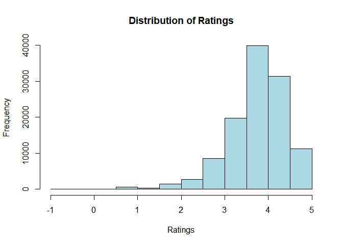
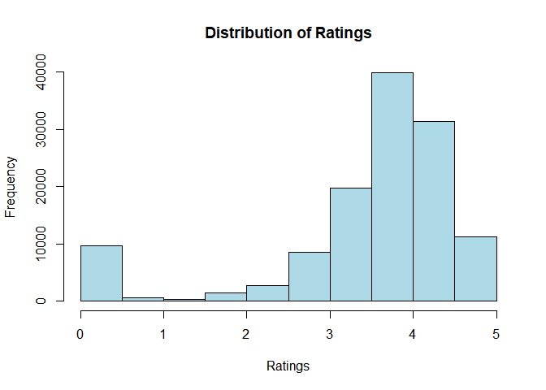

Frameworks Final Project: Data Cleaning
================

``` r
library(knitr);  library(DT);library(ggplot2);library(data.table); library(tidytext); library(stringr)
```

``` r
name = "Name"
city.name = "City"
cuisine.name = "Cuisine Style"
ranking.name = "Ranking"
rating.name = "Rating"
price.name = "Price Range"
number.reviews.name = "Number of Reviews"
review.name = "Reviews"
```

``` r
dat <- fread(input ='Data/TA_restaurants_curated.csv', verbose = FALSE)
```

``` r
# specialized function to calculate the numberic value of '$,$$,$$$,$$$$` ratings 
replace.value = function (data, colname, pattern = '-' ){

number = vector() 
for ( i in 1:nrow(dat)) {
 if (is.na(str_match(string = data[i, get(colname)], pattern = '-'))) {
     number[i] = nchar(data[i, get(colname)])
 } else { number[i] = ((nchar(data[i, get(colname)]) - 3) / 2)
  }
}

print(number)

}

mean.missing <- function(x) {
 return(mean(is.na(x)))
}
```

``` r
# Drop columns 
dat$ID_TA <- NULL
dat$URL_TA <- NULL
```

## Exploring missing data

``` r
paste0(round(mean.missing(x = dat) * 100,2), '% of all the data is missing')
```

    ## [1] "3.24% of all the data is missing"

``` r
# missing data by columns 
dat[, lapply(X = .SD, mean.missing)]
```

    ##    V1 Name City Cuisine Style    Ranking     Rating Price Range
    ## 1:  0    0    0             0 0.07688386 0.07671656           0
    ##    Number of Reviews Reviews
    ## 1:         0.1381695       0

### Exploring ranking

``` r
# number of ranking in each category  
ranking.count <- dat[, .(count = .N), by = ranking.name]

# view the data 
head(ranking.count,10)
```

    ##     Ranking count
    ##  1:       1    31
    ##  2:       2    31
    ##  3:       3    31
    ##  4:       4    31
    ##  5:       5    31
    ##  6:       6    31
    ##  7:       7    31
    ##  8:       8    31
    ##  9:       9    31
    ## 10:      10    31

    ## [1] "There are 16444 rankings in the data set with an average count of 7.05 in each rank, not including the NAs, which has 9651 values which represents 0.04% of the entire dataset"

The rank value represents the Rank of the restaurant among the total
number of restaurants in the city, and there are number of reasons as to
why it could be missing:

  - The restaurant is new, or no one has reviewed it yet. A solution
    that makes sense for the missing data is to the missing value should
    have a rank a level lower than the last rank in the data.

<!-- end list -->

``` r
# adding +1 to the max ranking to fix na's 

max.ranking <- max(dat$Ranking, na.rm = TRUE)
dat[is.na(get(ranking.name)), eval(ranking.name) :=  max.ranking + 1]

# count Na's in ranking
sum(is.na(dat$Ranking))
```

    ## [1] 0

# exploring Rating

``` r
hist(dat$Rating, xlab = 'Ratings', main = 'Distribution of Ratings', col = 'lightblue')
```

<!-- -->

``` r
ratings.count <- dat[,.(count = .N, `Percentage` = (.N/nrow(dat)) * 100), by = rating.name]
ratings.count
```

    ##     Rating count Percentage
    ##  1:    5.0 11257  8.9677918
    ##  2:    4.5 31326 24.9555872
    ##  3:    4.0 39843 31.7405817
    ##  4:    3.5 19745 15.7296837
    ##  5:    3.0  8524  6.7905710
    ##  6:    2.5  2720  2.1668645
    ##  7:    2.0  1437  1.1447736
    ##  8:    1.5   384  0.3059103
    ##  9:    1.0   620  0.4939176
    ## 10:   -1.0    41  0.0326623
    ## 11:     NA  9630  7.6716563

The data desription indicates that the rating for rating range from 1-5
yet we have a 41 values that are -1 in the dataset.

How can we address this: - replace the missing values with the mean,
median - replace the missing values based on stratisfied random sampling
based on the percentage of the range 1-5 - random numbers between 1-5 -
replace with a value of 0 or 1

Before we can make that descision, lets have look at the those
    data

``` r
summary(dat[get(rating.name) < 1 | is.na(get(rating.name))])
```

    ##        V1            Name               City           Cuisine Style     
    ##  Min.   :  468   Length:9671        Length:9671        Length:9671       
    ##  1st Qu.: 2860   Class :character   Class :character   Class :character  
    ##  Median : 6479   Mode  :character   Mode  :character   Mode  :character  
    ##  Mean   : 7802                                                           
    ##  3rd Qu.:14236                                                           
    ##  Max.   :18211                                                           
    ##                                                                          
    ##     Ranking          Rating     Price Range        Number of Reviews
    ##  Min.   :  469   Min.   :-1     Length:9671        Min.   :2.0      
    ##  1st Qu.:16445   1st Qu.:-1     Class :character   1st Qu.:2.0      
    ##  Median :16445   Median :-1     Mode  :character   Median :2.0      
    ##  Mean   :16304   Mean   :-1                        Mean   :3.6      
    ##  3rd Qu.:16445   3rd Qu.:-1                        3rd Qu.:5.0      
    ##  Max.   :16445   Max.   :-1                        Max.   :7.0      
    ##                  NA's   :9630                      NA's   :9666     
    ##    Reviews         
    ##  Length:9671       
    ##  Class :character  
    ##  Mode  :character  
    ##                    
    ##                    
    ##                    
    ## 

The restaurants that do not have a ratings also didn’t have a ranking.
They are either new or no one has reviwed them yet. The best course of
action is to replace with 0.

``` r
# replacing negative and na values with 0
dat[get(rating.name) < 1 | is.na(get(rating.name)), eval(rating.name) := 0]

hist(dat$Rating, xlab = 'Ratings', main = 'Distribution of Ratings', col = 'lightblue', breaks = 10)
```

<!-- -->

``` r
ratings.count <- dat[,.(count = .N, `Percentage` = (.N/nrow(dat)) * 100), by = rating.name]
ratings.count
```

    ##     Rating count Percentage
    ##  1:    5.0 11257  8.9677918
    ##  2:    4.5 31326 24.9555872
    ##  3:    4.0 39843 31.7405817
    ##  4:    3.5 19745 15.7296837
    ##  5:    3.0  8524  6.7905710
    ##  6:    2.5  2720  2.1668645
    ##  7:    2.0  1437  1.1447736
    ##  8:    1.5   384  0.3059103
    ##  9:    1.0   620  0.4939176
    ## 10:    0.0  9671  7.7043186

## Number of reviews

``` r
number.of.reviews.count <- dat[,.(count = .N), by = number.reviews.name]
setorder(number.of.reviews.count,-count)

ggplot(data = number.of.reviews.count, aes(x = `Number of Reviews` , y = count)) + geom_line() + theme_classic()
```

<!-- -->

``` r
# top 5 of review counts 
head(number.of.reviews.count)
```

    ##    Number of Reviews count
    ## 1:                NA 17344
    ## 2:                 2  5698
    ## 3:                 3  4687
    ## 4:                 4  3820
    ## 5:                 5  3388
    ## 6:                 6  2968

``` r
# count of number of NA 
dat[is.na(get(number.reviews.name)),.N, by = number.reviews.name]
```

    ##    Number of Reviews     N
    ## 1:                NA 17344

``` r
# summary 
summary(dat$`Number of Reviews`)
```

    ##    Min. 1st Qu.  Median    Mean 3rd Qu.    Max.    NA's 
    ##     2.0     9.0    32.0   125.2   114.0 16478.0   17344

The most likely reason that a restaurant wouldn’t have a review is
because no one botherered to review it.

The best way to fix it is to replace it with 0

``` r
# evaluate number of reviews NA as 0 
dat[is.na(get(number.reviews.name)), eval(number.reviews.name):= 0]
```

``` r
# missing data by columns 
dat[, lapply(X = .SD, mean.missing)]
```

    ##    V1 Name City Cuisine Style Ranking Rating Price Range Number of Reviews
    ## 1:  0    0    0             0       0      0           0                 0
    ##    Reviews
    ## 1:       0

no more missing data

### price range

``` r
# price count distribution
price.count <- dat[, .N, by = price.name]
price.count
```

    ##    Price Range     N
    ## 1:    $$ - $$$ 54360
    ## 2:        $$$$  4307
    ## 3:           $ 19005
    ## 4:             47855

``` r
# result 
price.count <- dat[, .N, by = price.name]
price.count
```

    ##    Price Range     N
    ## 1:         2.5 54360
    ## 2:         4.0  4307
    ## 3:         1.0 19005
    ## 4:         0.0 47855

## reviews

``` r
head(dat$Reviews)
```

    ## [1] "[['Just like home', 'A Warm Welcome to Wintry Amsterdam'], ['01/03/2018', '01/01/2018']]"                  
    ## [2] "[['Great food and staff', 'just perfect'], ['01/06/2018', '01/04/2018']]"                                  
    ## [3] "[['Satisfaction', 'Delicious old school restaurant'], ['01/04/2018', '01/04/2018']]"                       
    ## [4] "[['True five star dinner', 'A superb evening of fine dining, hospitali...'], ['12/20/2017', '12/17/2017']]"
    ## [5] "[['Best meal.... EVER', 'super food experience'], ['01/06/2018', '01/04/2018']]"                           
    ## [6] "[['A treat!', 'Wow just Wow'], ['01/01/2018', '12/26/2017']]"

``` r
write.csv(x = dat, file = 'Data/TA_restaurants_curated_clean.csv')
```
